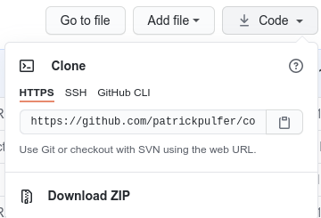

Website for PaddyOS - Submission to my first project at [Code Insitute](https://codeinstitute.net)

---

<br><br>


<a href="">
    
</a>

Note: PaddyOS is a fictional computer operating system. The aim of this project is to promote this software to the end user.

# Official Website for PaddyOS

## What is PaddyOS?

PaddyOS is a robust and reliable operating system based on Linux for everyone, featuring:

- No-nonsense and easy to learn UI with everything right where you need it. We don't use "bloatware" or other nuisance.
- PaddyOS is free to install, as we beleive that everyone should have access to a reliable system without cost. The computer is yours, why should you pay extra or be tracked by adds?

<br />

## Features

- Introduction Screen
  - First section presented to a user with the minimalistic approach and buttons to the most important sections.
- "What is" / Features page
  - Section for the end user to get an "at glance" overview of the software and its capabilities.
- Download
  - Download section allows the user download the software for installation.
- Contact Us form

  - Easy to use medium to contact developers for any queries or feedback.

- Website is mobile-friendly and optimized for right handed use (menu is on the right side)
- Website is compatible with Dark Mode (you can test with https://chrome.google.com/webstore/detail/dark-reader/eimadpbcbfnmbkopoojfekhnkhdbieeh)
- Website is also optimized for faster loading thanks to the Lazy Loading API (https://web.dev/browser-level-image-lazy-loading/)

### Ideas / Future Features

- Forum: An online place where users can interact with developers or other users
- FAQ: Most commonly asked questions & answers in a searchable format
- Newsletter or RSS

<br />

## Technologies used

<br />

### Tools Utilized during development of the website:

- A desktop PC with Linux [Pop!\_OS](https://pop.system76.com/) operating system installed
- [Visual Studio Code](https://code.visualstudio.com/) for manipulating .html .css and .md files
- [GIMP](https://www.gimp.org/) or GNU Image Manipulation Program to manipulate images utilized in this project (example paste picture inside Laptop screen)
- [WireframeSketcher](https://wireframesketcher.com/) to sketch visual aspect of website prior to development
- [Github](https://github.com/) for version control, backup & deployment to Gitpages
- The following browsers for compatibility & testing purposes (see Testing section for further details):
  - [Chromium](https://www.chromium.org/)
  - [Firefox](https://www.mozilla.org/en-US/firefox/new/)
  - [Microsoft Edge](https://www.microsoftedgeinsider.com/en-us/)
  - [Mobile Google Chrome](https://play.google.com/store/apps/details?id=com.android.chrome)

### Technologies/Tools incorporated into the website:

- [HTML5](https://www.w3.org/)
  - Project based **HTML5** for compatibility reasons, as all major browsers support it
- [CSS](https://www.w3.org/Style/CSS/Overview.en.html)
  - Cascading Style Sheets or **(CSS)** standard is also supported by all major browsers for styling the website
- [Bootstrap](https://getbootstrap.com/)
  - Bootstrap is a free and open-source CSS framework directed at responsive, mobile-first front-end web development
- [JQuery](https://jquery.com)
  - The project uses **JQuery** to simplify DOM manipulation.
- [Font Awesome](https://fontawesome.com/)
  - Icons utilized in this project are fetched from **Font Awesome**

<br />

## Development

If you are curious about the process of the development of this project, please [click here](./documentation/development.md).

<br>

## Deployment

### Current Deployment

The website is currently available at:

- [GitPages](https://patrickpulfer.github.io/codeinsitute_usercentric_milestone_project/index.html)

I have used the following method to deploy this website at GitPages but may also use this workflow to deploy any websites at GitPages:

1. Navigate to your GitHub Project
2. On the top of your project files, there is a menu bar. Click on "Settings"
3. In your settings view, scroll down until the section "GitHub Pages"
4. Here you can chose the Source (preferentially main branch) and Save to deploy
5. Note the URL at "Your site is published at XXXXXX". This will be the URL to share

### Further Deployment

You may deploy this website on your local machine for testing purposes.

On **_Linux_**, you can easilly do this on your terminal if you have git installed:

```
cd <to your prefered folder>
git clone https://github.com/patrickpulfer/codeinsitute_usercentric_milestone_project.git

```

To run, simply double click the index.html file in the target folder or run the following command:

```
xdg-open ./codeinsitute_usercentric_milestone_project/index.html
```

Downloading the source code as Zip file from GitHub is also a valid method for **_Linux_** and **_Windows_**. On the project page, look for the Code button with arrow down as shown below:



Note: You will have the extract the contents of your .zip file with your OS's decompression tool. [7zip](https://www.7-zip.org/download.html) is a good alternative.

Once unzipped, look for the index.html file and double click it.

## Credits

### Content

- The text under "Based on Linux" in the "What is PaddyOS" section is copied from [What is Linux article](https://www.linux.com/what-is-linux/). Citation on the paragraph has been marked with link to the same source.

### Media

- The background picture of the first section was fetched from https://unsplash.com/photos/9q3I8XhesQI
- The Macbook picture was sourced from https://www.hiclipart.com/free-transparent-background-png-clipart-msazr and manipulated with GIMP to copy/paste a screenshot of my desktop
- Pictures in Features section are screenshots taken from my own desktop

### Acknowledgements

- I'm a big fan of Linux and open source collaboration. My inspiration came from the great work on desktop Linux by project like Ubuntu (https://ubuntu.com/), Manjaro (https://manjaro.org/) and Debian (https://linuxmint.com/)
