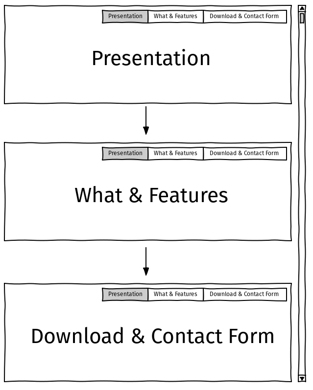

Website for PaddyOS - Submission to my first project at [Code Insitute](https://codeinstitute.net)

---

  

Note: PaddyOS is a fictional computer operative system. The aim of this project is to promote this software to the end user. 

# Official Website for PaddyOS

Official Website for PaddyOS

## What is PaddyOS?

PaddyOS is a robust and reliable operative system based on Linux for everyone, featuring:
* No-nonsense and easy to learn UI with everything right where you need. We don't use "bloatware" or other nuisances.
* PaddyOS is free to install, as we beleive that everyone should have access to a reliable system without costs and control. The Computer is yours, why should you pay or be tracked by adds?

 
## UX

### Strategy and Initial Stage of my Project

A medium was sought to promote a new operative system created by a pioneering group of Irish developers. This medium must be available 24/7 to potential international consumers.

I have concluded that the easiest way to share software is via the Internet. Therefore I've researched several websites of other popular and non-popular operative systems, including:
- Windows 10 (https://www.microsoft.com/en-ie/windows/get-windows-10)
- Ubuntu (https://ubuntu.com/)
- Manjaro (https://manjaro.org/)
- Linux Mint (https://linuxmint.com/)

### Scope of this Project

* The simplest form of promoting PaddyOS on the web requires HTML + CSS as core technologies for a static website
* Website must be available 24/7, so decision has been made to deploy to Github and Gitpages (see Deployment section for more details)
* 3 sections are required, so I've chosen the following:
    * Introduction (showcasing the "What is" and "Why use this")
    * Download (Access to download PaddyOS)
    * Contact Form (ability to contact us for getting involved and feedback)

### Structure

As visitors to website may or not be competent in computer driving, decision was made to organize the website as a single site where user can scroll trough sections.

I've decided to include a main menu, so users can quickly navigate to their prefered section.

### Skeleton

To be faithful to the structure established above, the overall website should be divided in 3 section as shown below:

To avoid a lenghty readme file, please visit [Wireframing Project PaddyOS Website](https://codeinstitute.net) for further study into the skeleton of the website.

### Surface

To emphasize project being led by developers in Ireland, decision has been made to include a color scheme based on the green color as per below:
* Main Color: #5C7D61
* Main ("white") background/font: #F3F0F1
* Dark Shades: #122D23
* Slightly lighter accent from main color: #8DB49E
* Slightly darker accent from main color: #7B9E8C

Note that fonts and main "white" background is not exacly white but an easier to the eyes color #F3F0F1.

Logo: Every product/brand should have a logo, so I've created a quick logo based on color #27cc9d which would showcase a balanced shape and caos in form of lines: 
  

## Features

In this section, you should go over the different parts of your project, and describe each in a sentence or so.
 
### Existing Features
- Feature 1 - allows users X to achieve Y, by having them fill out Z
- ...

For some/all of your features, you may choose to reference the specific project files that implement them, although this is entirely optional.

In addition, you may also use this section to discuss plans for additional features to be implemented in the future:

### Features Left to Implement
- Another feature idea

## Technologies Used

In this section, you should mention all of the languages, frameworks, libraries, and any other tools that you have used to construct this project. For each, provide its name, a link to its official site and a short sentence of why it was used.

### Tools Utilized during development of the website:
* A desktop PC with Linux [Pop!_OS](https://pop.system76.com/) Operative System installed
* [Visual Studio Code](https://code.visualstudio.com/) for manipulating .html .css and .md files
* [GIMP](https://www.gimp.org/) or GNU Image Manipulation Program to manipulate images utilized in this project (example paste picture inside Laptop screen)
* [WireframeSketcher](https://wireframesketcher.com/) to sketch visual aspect of website prior to development
* The following browsers for compatibility & testing purposes (see Testing section for further details):
    * [Chromium](https://www.chromium.org/)
    * [Firefox](https://www.mozilla.org/en-US/firefox/new/)
    * [Microsoft Edge](https://www.microsoftedgeinsider.com/en-us/)
    * [Mobile Google Chrome](https://play.google.com/store/apps/details?id=com.android.chrome)

### Technologies/Tools incorporated into the website:
- [HTML5](https://www.w3.org/)
    - Project based **HTML5** for compatibility reasons, as all major browsers support it
- [CSS](https://www.w3.org/Style/CSS/Overview.en.html)
    - Cascading Style Sheets or **(CSS)** standard is also supported by all major browsers for styling the website
- [Bootstrap](https://getbootstrap.com/)
    - Bootstrap is a free and open-source CSS framework directed at responsive, mobile-first front-end web development
- [JQuery](https://jquery.com)
    - The project uses **JQuery** to simplify DOM manipulation.
- [Font Awesome](https://fontawesome.com/)
    - Icons utilized in this project are fetched from **Font Awesome**

## Testing

In this section, you need to convince the assessor that you have conducted enough testing to legitimately believe that the site works well. Essentially, in this part you will want to go over all of your user stories from the UX section and ensure that they all work as intended, with the project providing an easy and straightforward way for the users to achieve their goals.

Whenever it is feasible, prefer to automate your tests, and if you've done so, provide a brief explanation of your approach, link to the test file(s) and explain how to run them.

For any scenarios that have not been automated, test the user stories manually and provide as much detail as is relevant. A particularly useful form for describing your testing process is via scenarios, such as:

1. Contact form:
    1. Go to the "Contact Us" page
    2. Try to submit the empty form and verify that an error message about the required fields appears
    3. Try to submit the form with an invalid email address and verify that a relevant error message appears
    4. Try to submit the form with all inputs valid and verify that a success message appears.

In addition, you should mention in this section how your project looks and works on different browsers and screen sizes.

You should also mention in this section any interesting bugs or problems you discovered during your testing, even if you haven't addressed them yet.

If this section grows too long, you may want to split it off into a separate file and link to it from here.

## Deployment

This section should describe the process you went through to deploy the project to a hosting platform (e.g. GitHub Pages or Heroku).

In particular, you should provide all details of the differences between the deployed version and the development version, if any, including:
- Different values for environment variables (Heroku Config Vars)?
- Different configuration files?
- Separate git branch?

In addition, if it is not obvious, you should also describe how to run your code locally.

## Credits

### Content
- The text for section Y was copied from the [Wikipedia article Z](https://en.wikipedia.org/wiki/Z)

### Media
- The photos used in this site were obtained from ...

### Acknowledgements

- I received inspiration for this project from X

Tools Used

Bootstrap: https://getbootstrap.com/
Font awesome:

white background: F3F0F1
Dark Shades, Cards, dark background and icons: 122D23
Main : 5C7D61
Light Accents: 8DB49E
Dark Accent: 7B9E8C

Images:
Logo: Self created
header background: https://unsplash.com/photos/9q3I8XhesQI

PC background: https://www.hiclipart.com/free-transparent-background-png-clipart-msazr

----

Mentor:
Stick to 3-4 sections
Idea is novel
Requirement to showcase wireframes (not mockups) / use balsamic
Requirement of planes of UX and write on readme
Contact form and validation is required and requires something saying thank you (bootstrap modal?, open new page?)
- Dont overdo it
- book right away mentor session
How to run locally explanation (how to git clone and double click html) 
testing (tools, how to test, screenshots? gif?)

Tablet
Mobile
Desktop

-----------

Questions:

Where do upload wireframe? readme?

Scope:

