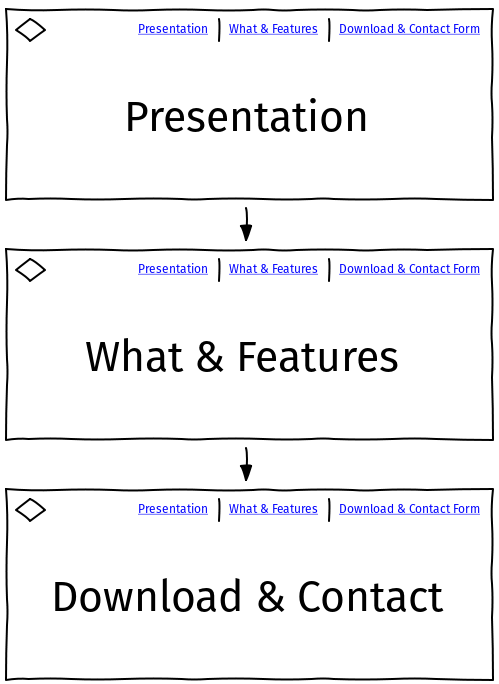

# PaddyOS - Official Website

### In this document, I will attempt to explain the process I went through in thinking, planning and developing this project by utilizing industry-standard methodologies.

 

## UX Design

 
For this project, I've adopted the methodology of the five planes of UX, which cosist of:

- Strategy
- Scope
- Structure
- Skeleton
- Surface Design

> “The Elements of User Experience” book written by Jesse James Garrett, one of the founders of Adaptive Path, a user experience consultancy based in San Francisco.

 

### Strategy

A medium was sought to promote a new operating system created by a pioneering group of Irish developers. This medium must be available 24/7 to potential customers around the globe.

I have concluded that the easiest way to share software is via the Internet. Therefore I have researched several websites of other popular operating systems, including:

- Windows 10 (https://www.microsoft.com/en-ie/windows/get-windows-10)
- Ubuntu (https://ubuntu.com/)
- Manjaro (https://manjaro.org/)
- Linux Mint (https://linuxmint.com/)

 

#### User Stories

I have consulted with a few future users of the website, including people from my work line in IT and also persons with limited computer driving experience.

Multiple users within my line of IT work:

- _"I want a simple website where I can download the file with maximum 3 clicks"_
- _"I want a easy-to-read website to gather more information on project and provide necessary feedback"_

Users with less computer driving experience

- _"What is Paddy OS ???"_
- _"I want to see images of how it looks like"_
- _"Is this something that I can use for free?"_

IT enthusiast / contributor

- _"I'd like to preview developer builds of next versions so I can test my software against it"_
- _"I want a reliable source for download"_
- _"I want an easily accessible overview so I can share with potential other collaborators"_
    

### Scope of this Project

- The simplest form of promoting PaddyOS on the web is a static website which requires HTML + CSS as core technologies
- Website must be available 24/7, so decision has been made to deploy to Github and Gitpages (see Deployment section for more details)
- Three sections are required, so I have chosen the following:
  - Introduction (showcasing the "What is" and "Why")
  - Download (access to download PaddyOS)
  - Contact Form (ability to contact us or send feedback)
      

### Structure

As visitors to website may or not be proficient in computer driving, decision was made to organize the website as a single site where user can scroll trough sections.

I have decided to include the Main Menu for users to quickly navigate trough the website.
  

### Skeleton

To be adhere to the structure outlined above, the overall website should be divided into three sections as shown below:

To avoid a lenghty readme file, please visit [Wireframing Project PaddyOS Website](./wireframes.md) for further study into the skeleton of the website.

Further development into wireframing and shaping the project can be found in [Wireframing the Project](./wireframes.md).

 

### Surface Design

To emphasize the origin of the project, decision was made to include a color scheme based on the green color as below:

- Main Color: #5C7D61
- Main ("white") background/font: #F3F0F1
- Dark Shades: #122D23
- Slightly lighter accent from main color: #8DB49E
- Slightly darker accent from main color: #7B9E8C

Note that fonts and main "white" background is not exacly white but an easier to the eyes color #F3F0F1.

Logo: Every product/brand should have a logo, so I have created a simple logo based on color #27cc9d which would showcase a balanced shape and chaos in form of lines:
  

 

## Testing

During the lifecycle of development, I've had several testing periods of one week, which has been performed by the end users mentioned above in my User Stories section.

I have also tested the website myself on multiple devices to ensure consistency in different browsers.

Tools used:

- [Chrome DevTools](https://developers.google.com/web/tools/chrome-devtools)
- Browsers:
  - [Chromium](https://www.chromium.org/)
  - [Firefox](https://www.mozilla.org/en-US/firefox/new/)
  - [Microsoft Edge](https://www.microsoftedgeinsider.com/en-us/)
  - [Mobile Google Chrome](https://play.google.com/store/apps/details?id=com.android.chrome)

 

## Bug Testing (Site functionalities)

### Test 1 - Browser Compatibility

1. Load the [Website hosted at GitPages](https://patrickpulfer.github.io/codeinsitute_usercentric_milestone_project/index.html) on all browsers mentioned above and look for inconsistencies

_Passing Criteria_: Website renders correctly on any popular browser

 

### Test 2 - Device Compatibility

1. Load the [Website hosted at GitPages](https://patrickpulfer.github.io/codeinsitute_usercentric_milestone_project/index.html) on Chrome's DevTools, click the "Toogle Device toolbar" button and select different devices sizes to observe the breakpoints. Website should be legible on any size used.
2. Load the [Website hosted at GitPages](https://patrickpulfer.github.io/codeinsitute_usercentric_milestone_project/index.html) on Google Chrome at a Mobile Device and observe if text is legible and pictures do load

_Passing Criteria_: Website renders correctly on mobile / laptop

 

### Test 3 - Errors at parsing HTML level

1. Load the [Website hosted at GitPages](https://patrickpulfer.github.io/codeinsitute_usercentric_milestone_project/index.html) on Chrome's DevTools, click on "Console" and verify if any error messages do appear

_Passing Criteria_: Website does not produce any error message

 

### Test 4 - Errors at anchoring level

1. Load the [Website hosted at GitPages](https://patrickpulfer.github.io/codeinsitute_usercentric_milestone_project/index.html) on any browser
2. Click on any link found in the website, particulary
   - Navigation Bar
   - Starter Section
   - Download Section (You may ignore the button "Download" at the bottom of the page of not doing anything)

_Passing Criteria_: All links work as expected except the last "Download" button (not yet implemented)
 
 

### Test 5 - Errors at form level

1. Load the [Website hosted at GitPages](https://patrickpulfer.github.io/codeinsitute_usercentric_milestone_project/index.html) on any browser
2. Scroll until you find the button to register yourself "Developer Edition"
3. Submit the form while empty and observe validation
4. Repeat step 3 but add a field each time
5. Close the modal and perform same test on Contact Us form

_Passing Criteria_: A Form validation should prevent you to submit if one of the fields are missing

 

### Report

- After several testing periods, end users have provided positive feedback.

 

## User Story / Feature Testing

When development cycle reached feature readiness, I've asked the previously mentioned users to get hands on the project and provide feedback if wishes/criteria has been met:

- _"I want a simple website where I can download the file with maximum 3 clicks"_
  - Download can be started with 3 clicks
- _"I want a easy-to-read website to gather more information on project and provide necessary feedback"_
  - Tester has provided positive feedback on the ability to gather project info + provide feedback via form
- _"What is Paddy OS ???"_
  - Tester has provided positive feedback on understanding what PaddyOS is after reading the website
- _"I want to see images of how it looks like"_
  - Tester acknowledges preview images are available
- _"Is this something that I can use for free?"_
  - Tester provided positive feedback on clarification if this can be used for free
- _"I'd like to preview developer builds of next versions so I can test my software against it"_
  - Tester provided positive feedback on availability of a developer build. He also noted registration is a good strategy to get access to developer only features
- _"I want a reliable source for download"_
  - Website and file is available 24/7
- _"I want an easily accessible overview so I can share with potential other collaborators"_
  - Website is available 24/7 on easy Gitpages, allowing easy share of the URL to collaborators
